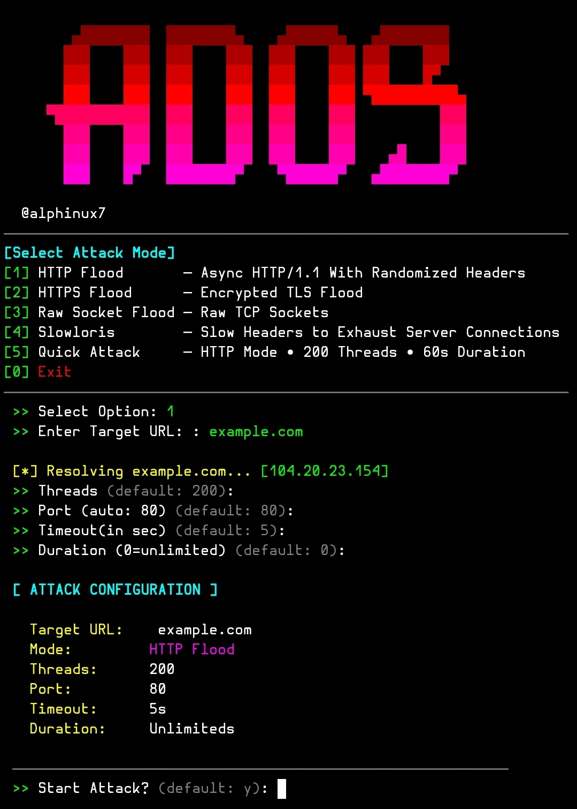

# Ados

A lightweight **Python DoS testing tool** designed to run in **Termux (No Root Required)** and other Linux environments.

## ⚙️ Installation (Termux)

### 1. Clone the repository

```bash
git clone https://github.com/alphinux/Ados.git
```

### 2. Enter the project folder

```bash
cd Ados
```

### 3. Make the files executable

```bash
chmod +x *
```

### 4.Install aiohttp

```bash
pip3 install aiohttp
```

### 5. Run the tool

```bash
python3 a-dos.py
```

## 📱 Requirements

- Python 3
- Termux (No Root Required) or any Linux distribution

## ⚠️ Warning

**This tool is intended only for authorised security testing and educational purposes.**

- ✅ Use only on systems you own or have explicit permission to test.
- ❌ Do not use this tool against public websites, servers, or networks without authorisation.
- The author is **not responsible** for any misuse or damage caused by this software.
- You are solely responsible for complying with your local laws and regulations.

## 📜 License

Use responsibly and ethically.
